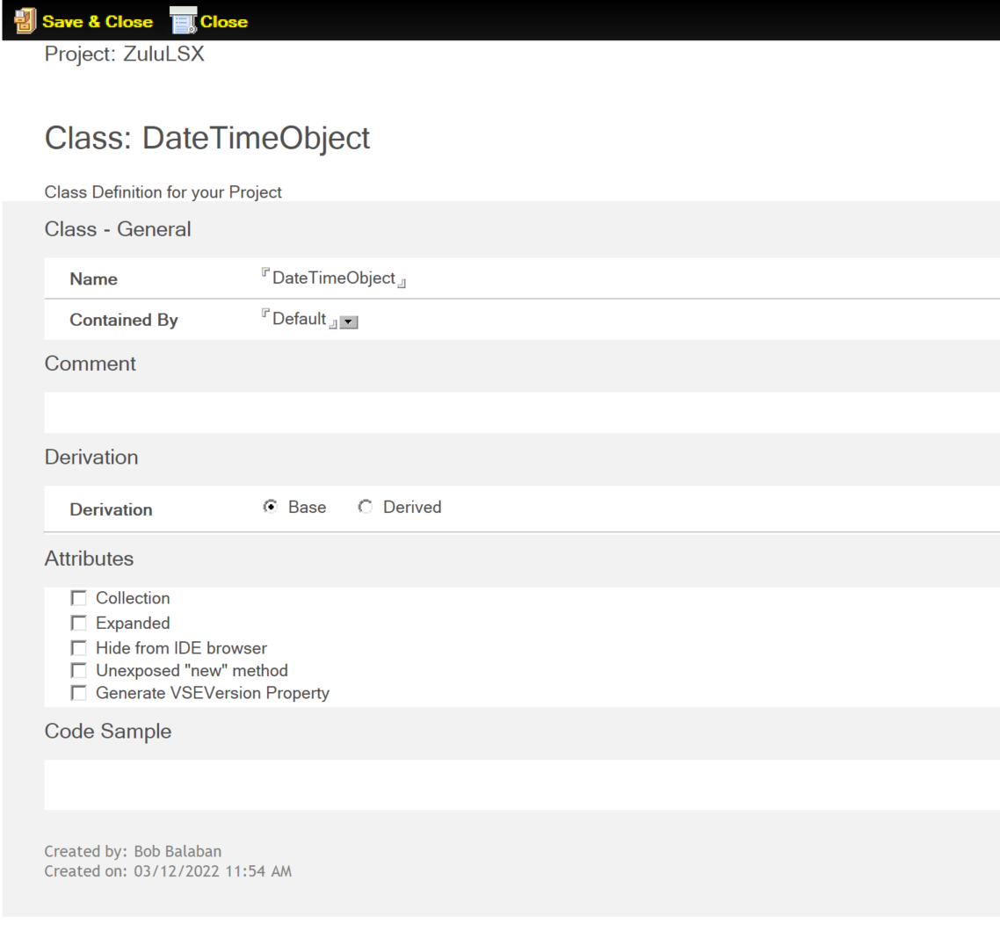

# Class

The *Class* form defines one or more Classes for your Extension project.  



The following sections describe the fields on the Class form.

## Name

The class name is used in naming four VSE source files: 

- `<cname>.hpp`
- `<cname>.cpp`
- `i<cname>.cpp`
- `i<cname>.tab`

!!!note
    The name cannot be a LotusScript keyword or a C++ keyword.

## Contained By

The default value of this field is *Default*, which means that the class is not contained by any other class in the project.

The drop-down list shows the names of classes already defined in the project. The class can be contained by any one of these. Instances of a contained class will be destroyed when the containing instance of the container class is destroyed. It's impossible to *New* a contained object from LotusScript. The container class must provide a method for instantiating a contained class.

## Comment

Enter any information that pertains to the Class as needed in this field.

## Derivation

Choose **Derived** if this Class is derived from another class, or **Base** if this Class is not derived from another class. **Base** is the default option. 

<!--Choose whether this Class is derived from another class (Derived) or not (Base, the default).-->

If you choose **Derived**, the **Derive From** field appears. Select the Class from which your new class is derived. The drop-down list shows the names of classes already defined in the project, and the Notes back-end classes.


!!!note
    If the "New" method of the base class takes arguments, you must edit the "New" method of the derived class so that the first arguments match exactly, and in the same order, the arguments of the base class. You may add any other arguments after these. This is because the Wizard must generate the code to call the base class constructor, and this is the only way to know which arguments to pass to it.

## Attributes

The following attributes may optionally be selected as needed:

- [Collection](#collection)
- [Expanded](#expanded)
- [Hide from IDE browser](#hide-from-ide-browser)
- [Unexposed "new" method](#unexposed-new-method)
- [Generate VSEVersion Property](#generate-vseversion-property)

### Collection

Select **Collection** to define the class as a collection class<!--, click **Collection** under **Attributes**-->. A collection is a data structure similar to an array, which supports the `ForAll ... Next` syntax. Two drop-down lists become visible when this attribute is selected:

- **Collection Data Type** - The datatype of the objects to be collected. The drop-down list contains LotusScript datatypes, Domino Objects that are formerly called Notes back-end classes, and classes already defined in the project. You should select the datatype of the items in the collection.
- **Collection Index Data Type** - The datatype of the index into the collection. The drop-down list contains LotusScript datatypes. You should select the datatype of the index.

**Example** 

If the collection index is a String, an element in the collection is accessed by a construct like this:

    theCollection("Item1")

If the index is an Integer, this is the form of the syntax:

    theCollection(1)

### Expanded

An expanded class is one which allows the script writer to add properties on the fly. For example, declaring a class Expanded allows for running a script that contains code like this, even if the property `MyOwnProp` doesn't exist in the VSE:

```
MyClass.MyOwnProp = "A Variant value"
Print MyClass.MyOwnProp`
```

### Hide from IDE browser

By default, VSE classes and their properties, methods, and events show up in the Browser (or Object References) pane of the Domino Designer Client under Notes Classes. Select this attribute if you do not wish this property to be visible in the Browser. 

!!!note
    Even if the property is hidden, it can still be accessed from a script if the script writer knows about its existence through other documentation.

### Unexposed "new" method

When you first save a Class document, a *New* method is automatically created, which is a constructor function for the class, representing it by a Function document. Every class needs a New method, whether or not the method is exposed, to users of the VSE in the class.

You cannot give some other method the name "New." With limitations, you can manipulate the definition of New that the Wizard generates:

- You cannot delete it.
- You cannot change its return value type, which is automatically the class itself. You cannot make the method a sub instead of a function.
- The Wizard creates the New function without arguments. You can add arguments to the signature.

The attributes on the Class form include **Unexposed "new" method**. If you select this attribute, the New method for the class will not be exposed to LotusScript. It will just be available internally in the class.

There are two main uses for a class with the New method unexposed:

- As an abstract class: A class that cannot have any instances created. The purpose of such a class is to enable other classes to inherit from it.
- To force the end user to create class instances using a provided "create" or "get" function on a containing class, rather than the New in the class.

The default is "exposed": The **Unexposed "new" method** is not selected by default. However, if you are creating a class and you specify that it's contained, the checkbox corresponding to this attribute is selected and you cannot change this option. New is always unexposed for a contained class.

### Generate VSEVersion Property

Select this attribute to automatically generate a VSEVersion Property constructor document under the class.