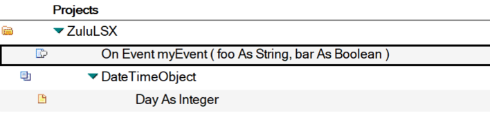
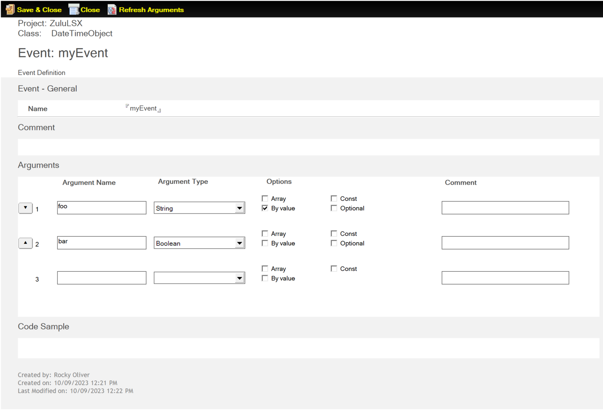
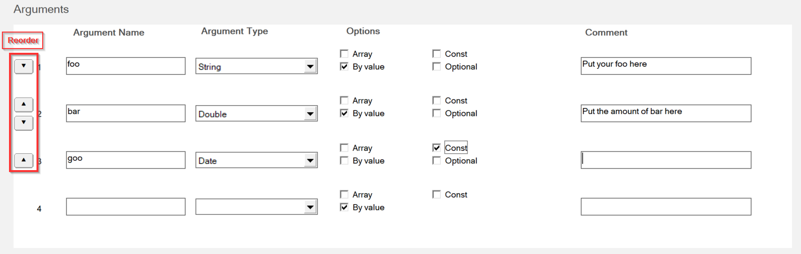

# Event

The *Event* form is used to define one or more Events for the Classes in your Extension project.

When you create an Event for your class, it appears in the **Projects** view with *OnEvent* preceding it as shown:

The following sections describe the fields on the Event form.

## Name

The name of the event. An event name **should not** be a VoltScript, LotusScript, or a C++ keyword.

## Comment

Enter any information relevant to the Event in this field.

## Arguments

The **Arguments** field of the Event form can be used to define up to ten arguments for your Event. The **Arguments** interface automatically detects when a new **Argument Name** and **Argument Type** have been provided, and displays a new row to accept a new argument should more be needed.

The following are the parts of the **Arguments** interface.

- **Reorder** - Use these arrows to move the arguments up or down in the list.
- **Argument Name** - Argument names **should not** be C++ keywords. Argument names can be LotusScript or VoltScript keywords, because they never appear in the script code.
- **Argument Type** - The drop-down list consists of VoltScript datatypes, Notes back-end classes, and classes already defined in the project.
- **Options** - Allows you to choose the appropriate options for an argument. The available options are:

    - **Array** - Select this option to indicate that the argument is an array of the specified **Argument Type**.
    - **By value** - Select this option to indicate that the argument can be passed By Value. For scalars, the default is by value. For complex datatypes, such as String, Date, and Array (any kind of array), the default is by reference. Your VSE classes and Notes back-end classes are always passed by reference.
    - **Const** - Select this option to indicate that the argument is a const.
    - **Optional** - Select this option to indicate that the argument is optional.

    !!!note
        Not all combinations of options are possible or allowed

    The rules for how the Options affect each other are as follows:

    - Scalar data types default to be passed By Value, but may be changed to by Ref 
    - Arrays must be By Ref
    - Arrays may not be Optional 
    - Objects may not be Optional 
    - If an argument is marked Optional, all subsequent arguments must be Optional. This means all Object arguments must appear **before** any Optional arguments. 
    - Options should no longer be cleared when changing Data Type
    - Arguments that are marked By Ref and Optional must also be Const.
    - Only Arguments marked as Optional may have an Optional Value
    - Currency and Date data types marked as Optional may not have an Optional Value

- **Comment** - Enter any optional comments you wish to provide about the argument in this field.

!!!tip
    To remove an argument from the list, clear the **Argument Name** field.

