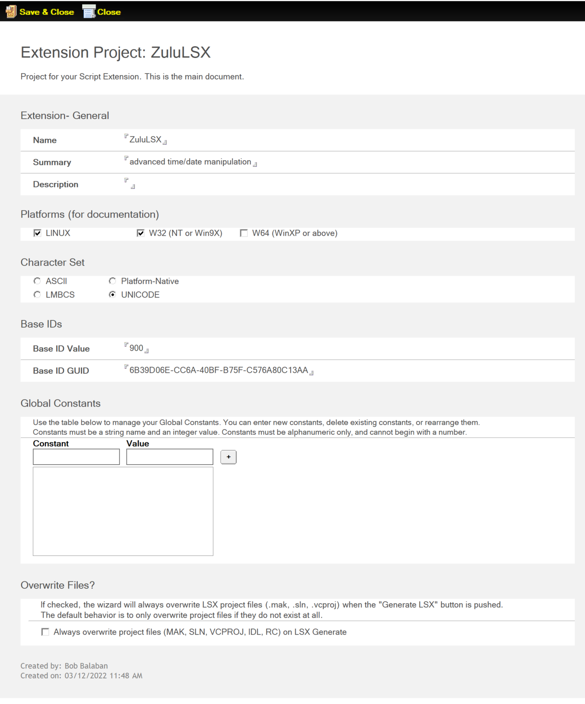
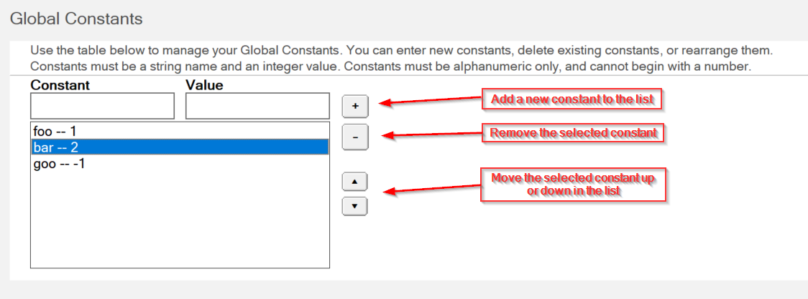

# Project

The *Project* form is used to define the general information about your Extension project, including what platform or platforms it will work on, the character set used by the extension, the GUID for the project, and global constants.  

The following sections describe the fields on the *Project* form.

## Name

The name you specify here has three roles. It becomes:

- the Project name in the **Script Extension Projects** view
- the `<vse_name>` in the VSE source-file directory `vse\src\<vse_name>` in the file system on your local drive
- the filename of the DLL or other shared library that's the built VSE

## Summary, Description

You can add an optional summary and description of your project in these fields. 

## Platforms

Select one or more platforms you wish to support with your Extension. You must select at least one platform. The results of choosing any platform are:

- a MAKE file and a `.def` file, or its equivalent, for each designated platform in the source-file directory
- platform-related conditional compilations within the C++ source files

## Character Set

This field specifies how to represent strings passed into and out of the VSE. Choose the character set supported by your Extension. The default is **UNICODE**.

## Base IDs

On a Windows platform, the Wizard checks whether the Microsoft utility GUIDGEN or UUIDGEN is present on the machine before displaying the form. The Wizard invokes the utility to get a GUID and inserts the value in the **Base ID GUID** field when the form displays.

## Global Constants

The default is blank, meaning no constants. To define a global constant in the VSE, enter the name and value of your constant in the **Constant** and **Value** fields, and then click the **Add** **( + )** button. The value of your constant *must* be an Integer.

To remove a constant, select the one you wish to remove, and then click the **Subtract ( - )** button.

To move a constant up or down in the list, select the constant you wish to move, and then use the **Up ( ▲ )** or **Down ( ▼ )** button to relocate it accordingly.

## Overwrite Files?

Select the checkbox if you wish to overwrite existing project files, such as MAK, SLN, when generated.