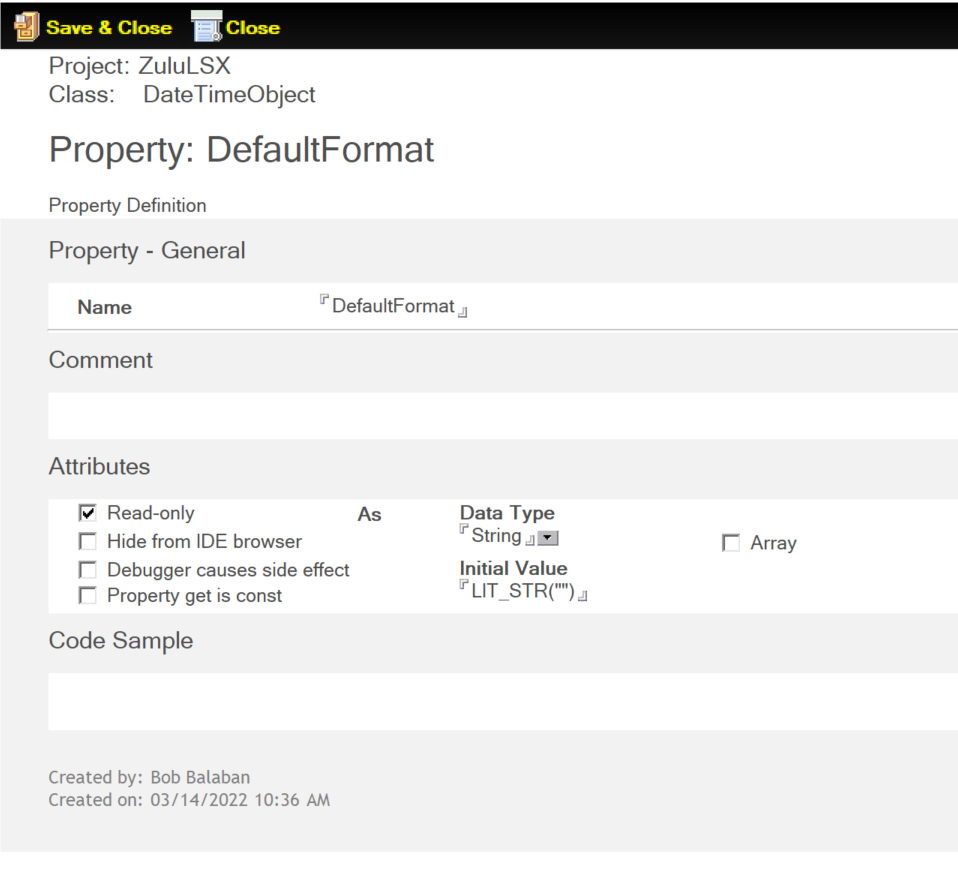

# Property

The *Property* form is used to define one or more Properties for your Extension project.  

The following sections describe the fields on the Property form.

## Name

The name of the property. A property name **should not** be a VoltScript, LotusScript, or a C++ keyword.

## Comment

Enter any information relevant to the Property in this field.

## Attributes

The following Attributes may optionally be selected as needed: 

- [Read-only](#read-only)
- [Hide from IDE browser](#hide-from-ide-browser)
- [Debugger causes side effect](#debugger-causes-side-effect)
- [Property get is const](#property-get-is-const)
- [Data Type and Initial Value](#data-type-and-initial-value)

### Read-only

Select this attribute to indicate that the value of this property may not be set from VoltScript. If a script tries to change the value of this property, it gets a syntax error indicating that the property is read-only.

Also, no `Set<property_name>` function will be generated from this property, so the value may only be set from within its own class.

### Hide from IDE browser

By default, VSE classes and their properties, methods, and events show up in the Browser or Object References pane of the Domino Designer Client, in the section headed Notes Classes. Select this attribute if you do not want this property to be visible in the Browser.

!!!note
    Even if the property is hidden in this way, it can still be accessed from a script if the script writer knows about its existence through other documentation.

### Debugger causes side effect

The debugger in the Domino Designer Client shows the current value of the property by calling, indirectly, the `Get<property_name>` function in your VSE. If the `Get<property_name>` method does something like incrementing a counter, in addition to returning the value of the property, this may not be desirable behavior. If this is the case for your property, select this attribute to turn off debugging for this property.

### Property get is const

This attribute refers to the way the code for the `Get<property_name>` method is generated in C++.

Usually, this method can be declared const because it doesn't change any of the data values in your class. If this is the case, it's desirable to declare the method as const, because then it can be used by const instances of your class.

Sometimes, however, this method can not be const. For example, if you need to do reference counting, or if you need to refresh a cache. In this situation, you should clear the checkbox corresponding to this attribute.

### Data Type and Initial Value

In the **Attributes** area, you can also specify the **Data Type** and **Initial Value** of this property. 

The **Data Type** field is where you select the data type of the objects to be collected. The drop-down list contains LotusScript datatypes, Domino Objects formerly called Notes back-end classes, and classes already defined in the project. You should select the datatype of the items in the collection.

The **Initial Value** field refers to the value that the property should be initialized to in the constructor's member initialization list for the class. This field may be a set to a literal value, or to the name of one of the arguments that you have specified for your constructor (the New method). 

**Example**

- If you have specified a property named *MaxSize*, you could select an **Initial Value** of 10. Then, the code generated in the constructor's member initialization list will be *m_MaxSize(10)*.
- If you have specified an argument to your constructor named *max_size*, you could set the **Initial Value** field to *max_size*. Then, the code generated in the constructor's member initialization list will be *m_MaxSize(max_size)*.

If the argument doesn't exist or the **Initial Value** is not of the correct datatype for the property, the generated C++ code will not compile.

!!!note
    You can also specify if your property is an Array of the selected data type by selecting the **Array** checkbox.