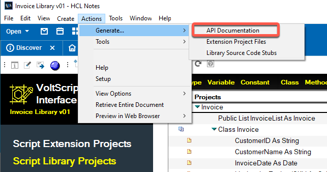
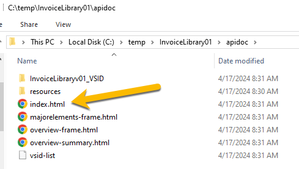
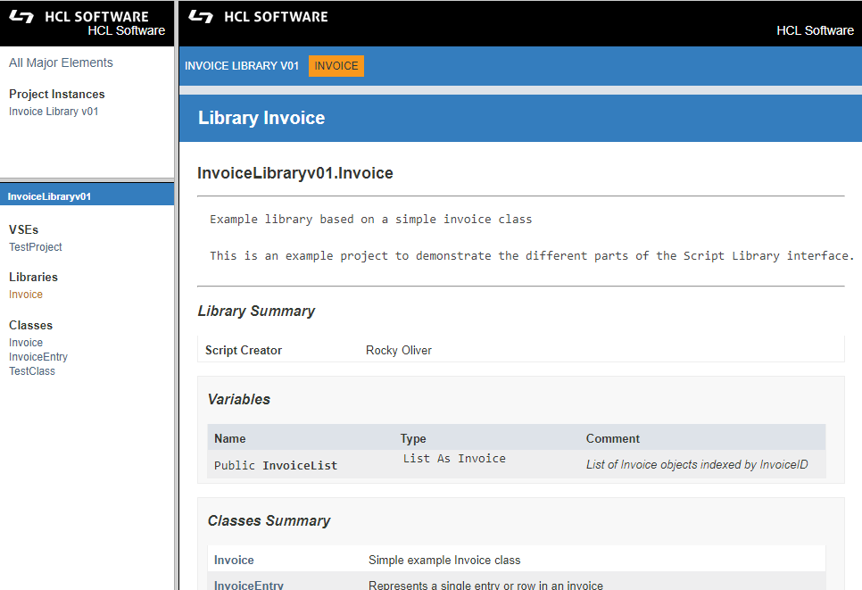

# Generate API Documentation

After you have created project documents (either Script Extension, Script Library, or both) in your VoltScript Interface Designer (VSID) database, you can generate API documentation.  

1. Open either the **Script Extension Projects** or the **Script Library Projects** view.
2. Select **Actions** &rarr; **Generate** &rarr; **API Documentation**.

    

3. When propmpted, enter the location where you would like to generate your API documentation, and then click **OK**.  

    <!---->

4. A fully self-contained API documentation website (html, css, and javascript files) will be generated for your project in the location you specified. Depending on the number and complexity of your project documents this may take several minutes. Click **OK** when finished. 

5. Navigate to the location you specified and you will see a folder called **apidoc**.  Open that folder and double-click **index.html**.  

    

    The API documentation website should launch in your default browser. 

    

!!!tip
    To publish this documentation to an external location, simply copy the **apidoc** folder including all its content and subfolders to the external site. 

    

