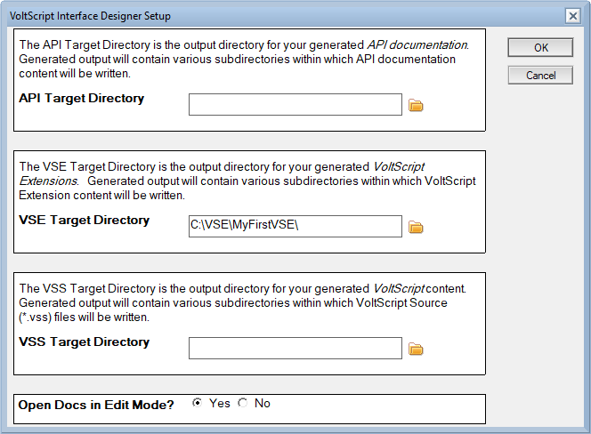
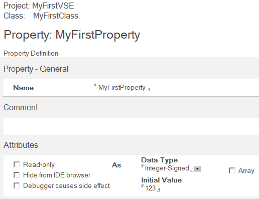
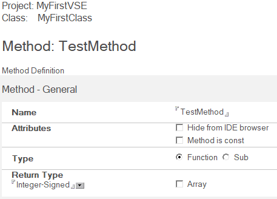
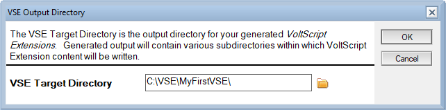

# Generate a new VoltScript Extension

## Introduction

VoltScript Extensions (VSE's) are native libraries for the VoltScript runtime, using the same well-known interface as earlier LotusScript Extensions (LSX's). As native code, they provide a way to write new classes and objects with more complex functionality or that use an existing third-party library. VoltScript Interface Designer (VSID) provides a way to describe the classes, properties, and methods of a VSE, and then generates C++ skeleton code based on the interface. This code uses modern [CMake](https://cmake.org){: target="_new" rel="noopener noreferrer”} as its build system, allowing a developer to use a text editor or IDE of their choice to implement the design.

## VoltScript Interface Designer

VSID is distributed as a .ntf template and a .dll LSX for the Windows version of HCL Notes&reg; 14.0. The template provides the form for designing a VSE or VoltScript library, with the .dll handling C++ code generation. The LSX will need to be registered first, so that it can be loaded by Notes.

To get started designing your own VSE, you'll need to install and set up VSID. Detailed instructions are available [in the tutorial section](../tutorials/setup.md).

1. Extract the VSID template and .dll to a directory of your choice. This example will use the path `C:\VSE\`, your Notes data directory will work as well.

1. Close Notes 14.0 if it is open. Register `vsidwizard.dll` in the Windows Registry. See [Register the wizard DLL](../tutorials/setup.md#register-the-wizard-dll) for more information.

    You can add the value yourself using the Registry Editor, or by running this command in an elevated command prompt, replacing `C:\VSE\vsidwizard.dll` with the full path to the DLL on your system:

    ```cmd
    REG ADD HKLM\Software\Lotus\Components\LotusScriptExtensions\2.0 /v lsxwizard /t REG_SZ /d "C:\VSE\vsidwizard.dll" /f
    ```

1. Import the VSID template (`vsid.ntf`) into your Notes 14.0 client. An easy way is copying it into your Notes data directory.

1. Open Notes 14.0 and create a new database, using "VoltScript Interface Designer 1.0.0" as the template. This example will use the name "My First VSE". The new database will be automatically opened to the "Script Extension Projects" view.

1. Set the paths VSID will use when generating the VSE. In the top right corner of the view is a "Setup" button.

    

    Click this to open the setup dialog. The second entry, "VSE Target Directory", is the directory the generated VSE files will be written to. You can set this to any directory you want - use the folder icon to the right of the text field to choose a folder, or enter the path directly. This example will use `C:\VSE\MyFirstVSE\`.

    

## Designing & generating a new VSE

VSID provides an interface for creating and modifying the programming interface for a VSE, such as the names and data types of properties and functions. We'll use it to create a simple VSE.

1. Make sure "Script Extension Projects" is selected from the left hand pane in VSID.

1. Create a project. Along the top black bar of VSID, click the "Project" button to create and open a new project document. Fill in the fields for name, description, etc. as needed. "Name" is the name of the VSE, and will be referenced by any scripts that use it. For this example, we will set the name to "MyFirstVSE". Click "Save & Close" at the top left of the document to save your changes and return to VSID.

1. Create a class. With the project selected, click the "Class" button from the top of VSID to create and open a new class document in that project. Fill in the name field for the name - this will be used as the name of the class in the scripts. For this example, we will set the name to "MyFirstClass". Click "Save & Close" at the top left of the document to save your changes and return to VSID.

1. Give the class a property. With the class selected, click the "Property" button to create a new property. Properties are available to both VoltScript and C++, and can be used to expose data or provide a control. Set the name of the property, as well as its data type and optionally its default value when an instance of this class is created. For this example, we'll create a property with the name "MyFirstProperty", the data type "Integer-Signed", and the initial value "123".

    

    Click "Save & Close" at the top left of the document to save your changes and return to VSID.

1. Give the class a method. With the class selected, click the "Method" button to create a new method. Methods can be called by VoltScript, and are generated as C++ methods. A method can be a function (has a return value) or a sub (no return value), and can optionally have a number of arguments with default values. For this example, we'll create a method with the name "TestMethod", the type "Function", and the return type "Integer-Signed". The default return value for this data type is 0.

    

    Click "Save & Close" at the top left of the document to save your changes and return to VSID.

1. Press "Generate Extension Files." Note that you will need to have a document in the "Script Extension Projects" selected to be able to run this. A dialog will pop up for the directory to generate files to, defalting to the one set in "VSE Target Directory" in the VSID Setup dialog. Review the path, changing it if needed, and press "Ok" to generate the files, along with the needed common header and source files.

    

You can edit any document in VSID by double-clicking on it to open. Comment and Code Sample fields can be left empty, but will be referenced when the documentation is generated.

## Building and testing a new VSE

After generating our C++ code, we can begin development. We'll start by building and testing the freshly generated VSE. All methods and functions will be given dummy values to allow the code to be compiled and loaded by VoltScript without editing any source first.

1. Build the VSE, either using the generated build script or another tool like Visual Studio Code. You will need a build environment with the 64-bit MSVC compiler and CMake available. If you have Visual Studio installed, a command prompt with the needed tools is in your start menu - search for "x64 Native Tools Command Prompt for VS". Navigate this command prompt to your generated VSE and run the generated build script: `build.bat --debug`. You can get help on using this script by running `build.bat --help`.

1. Write a test VoltScript file that loads the VSE and interacts with it. For our example, here is a test script that interacts with our project, class, property, and method:

    ```VB
    Option Public
    Option Declare

    UseVSE "*MyFirstVSE"

    Sub Initialize

        Dim hello as New MyFirstClass

        Print "Testing reading a VSE property:"
        Print hello.MyFirstProperty

        Print "Testing calling a VSE method:"
        Print hello.TestMethod()

    End Sub
    ```

    For this example, this file will be located at `C:\VSE\MyFirstVSE\hello.vss`.

1. Run the script using VoltScript. VoltScript will need to be provided the path to the newly built VSE through `seti.ini`. The CMake build system will automatically generate a sample `seti.ini` with the path the built .dll in `bin/w64/`, as `seti-D.ini` for "debug" builds and `seti.ini` for "release" builds. You can pass the path to this `seti.ini` to VoltScript through the `--seti` option on the command line.

    For this example, we can run our test script against our earlier debug build by running VoltScript like this: `VoltScript.exe --seti bin\w64\seti-D.ini hello.vss`.

    The output of a successful test would look like this:

    ```cmd
    Testing reading a VSE property:
     123
    Testing calling a VSE method:
     0
    ```

## Next steps

Now that we have a functional VSE, we can use it as the starting point for further development. A development flow might look like this:

* Implement the functionality of the VSE to provide a powerful library to your VoltScript projects. The most important files will be in the `src/VSEName` folder, where VSEName is the name of the project, like "MyFirstVSE". Files named after classes, like "MyFirstClass.cpp" and "MyFirstClass.hpp", will be populated with stub code for the methods and properties set in VSID.

* Add additional properties or methods and regenerate the VSE. Throughout the generated code are commented tag strings like `//{{LSX_AUTHOR_CODE_` and `//}}`. The code generation step will preserve any code between these tags, allowing existing implementations to be kept when the generation is run again.

* Use a source control tool like [git](https://git-scm.com){: target="_new" rel="noopener noreferrer”} to track changes and share your VSE with other developers.

* Review the generated `CMakeLists.txt` file and note how external libraries can be included.

* Test your VSE on your target platforms, such as the VoltScript Dev Container. The generated build system works on both Windows and Linux.
