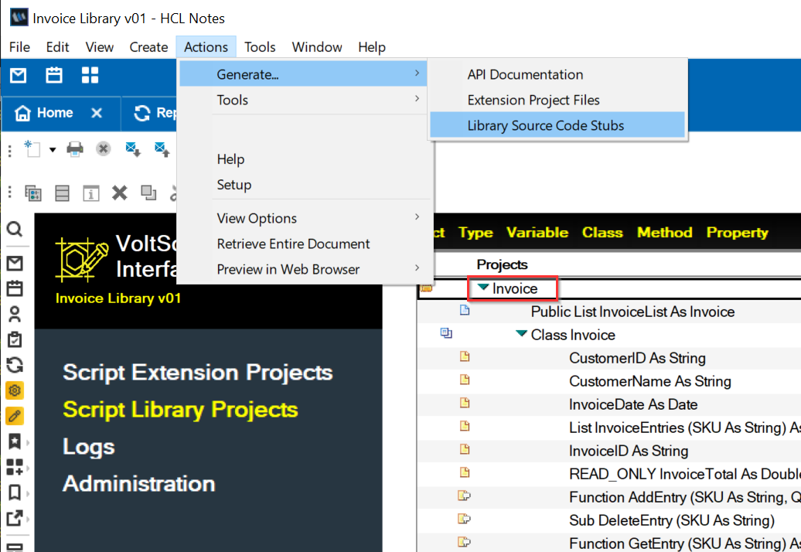
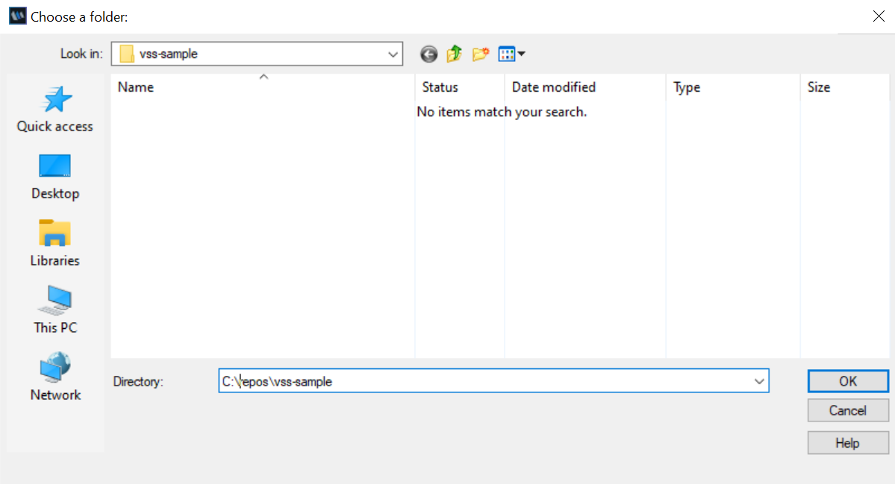
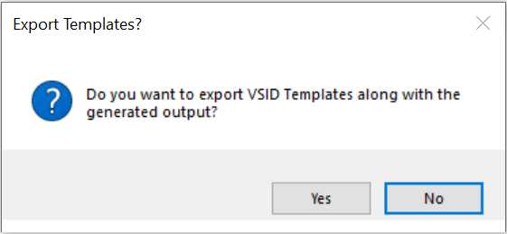

# Generate VoltScript Library code

Once you have created your library in your VoltScript Interface Designer (VSID) database, you're ready to generate your "starting code" so you can begin development in earnest on your library. 

1. Select your Project in the **Script Library Projects** view.
2. Select **Actions** &rarr; **Generate** &rarr; **Library Source Code Stubs**.

    

3. Enter the location where you like to generate your VSS code when prompted, and then click **OK**. 

    

4. In the **Export Templates?** dialog, click **No**. <!--nce you have provided a location for your code, you will be asked if you would like to export the VSID Templates along with your code output.--> 

    

    !!!note
        Usually, you will not need to export the VSID templates. This is simply provided for troubleshooting. In case you're curious about how the templates are applied and used to generate your code, click **Yes** in the **Export Templates?** dialog.

<!--!!!Note
    Usually you will not need to export the VSID templates; this is simply provided for troubleshooting, or if you're curious about how the templates are applied and used to generate your code. This is why the default value is "No".-->

