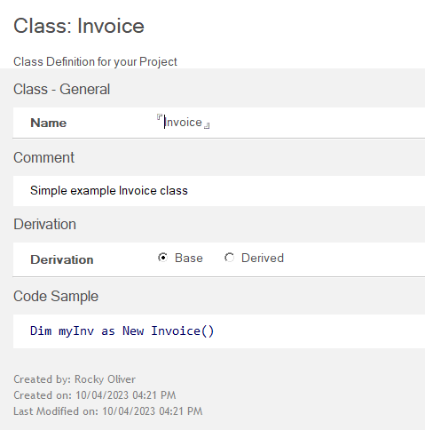
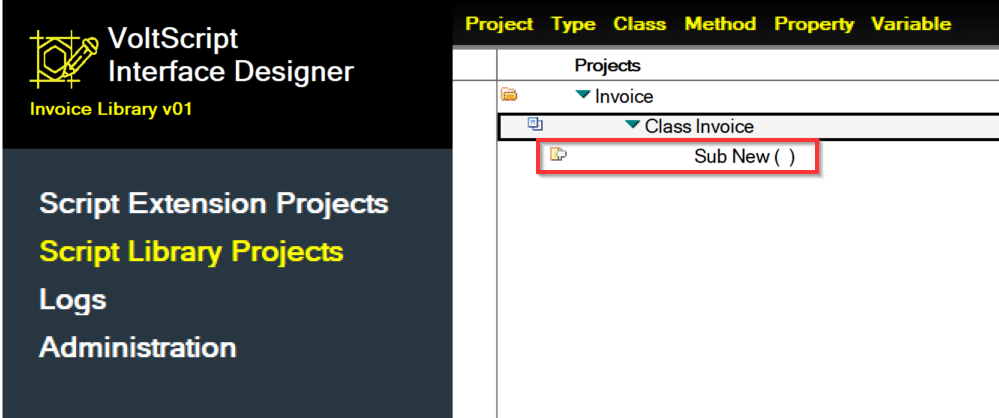
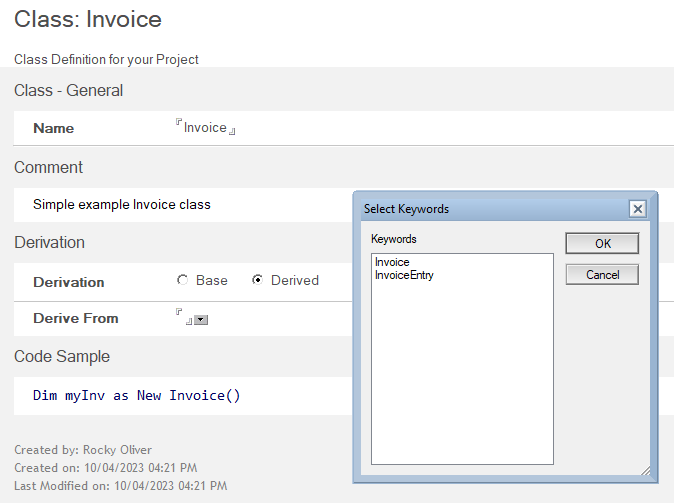
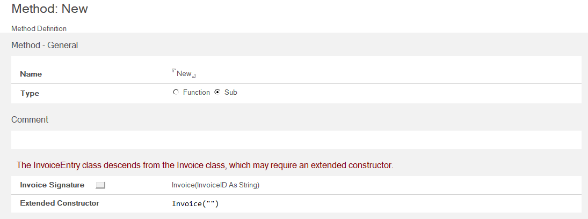

# Class

The *Class* form is used to define a Class for your Project. You specify the name of your Class, provide any helpful comments, and optionally some sample code demonstrating how to invoke the class.  

When you save your new Class for the first time, a Method document for the class constructor (the "New" method) will be automatically generated.  

The following sections describe the fields on the Class form.

## Name

The name of the Class.  

!!!note
    The name cannot be a LotusScript or C++ keyword.

## Comment

Enter any information that pertains to the Class as needed in this field.

## Derivation

Choose **Derived** if this Class is derived from another class, or **Base** if this Class is not derived from another class. **Base** is the default option.  

<!--Choose whether this Class is derived from another class (Derived) or not (Base, the default).-->

If you choose **Derived**, the **Derive From** field appears. Select the Class from which your new class is derived. The drop-down list shows the names of classes already defined in the project.

!!!note
    If the "New" method of the base class has differing arguments than the derived class, you must provide a value for the **Extended Constructor** field. The constructor signature of the base class will be visible to help provide you with a guide when typing in the Extended Constuctor.  
    
