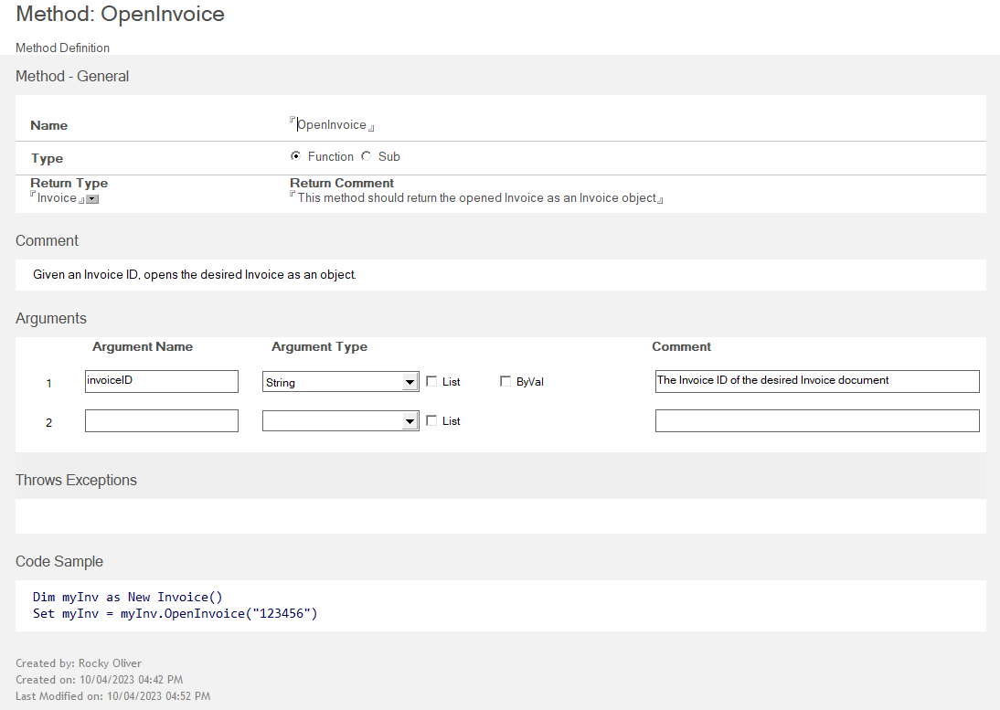

# Method

The *Method* form is used to define Method(s) for your Project Library or Class. The Methods defined can either be a *Function* (does some work, returns a value) or *Sub* (does some work, does NOT return a value).  For our example Invoice class we need to provide a way to open an existing Invoice as an object, so we have created an `OpenInvoice` method.

In the Method form you give your Method a name, indicate if it is a Sub or Function, and (for Functions) the Data Type returned. You can optionally provide a comment about the Method.  

Most Methods will take one or more *Arguments*, and those can be defined in the Arguments section. In our example we need to provide an argument that allows an Invoice ID to be passed in.

Then you can provide any known exceptions which can be thrown, and some sample code if desired.

The following sections describe the fields on the Method form.

## Name

The name of the method. A method name **should not** be a VoltScript, LotusScript, or a C++ keyword.

## Type

In this field, you can identity a Method document in as either a *Function* or a *Sub* by selecting the appropriate radio button.

- A *Function* is a method that returns a value.  
- A *Sub* is a method with no return value.  

If the method is a *Function*, you must specify a **Return Type**, which is the Data Type returned by the method. You can also indicate if the method is returning an array of values by selecting the **Array** checkbox.  

## Comment

Enter any information relevant to the Method in this field.

## Arguments

The **Arguments** area of the Method form can be used to define up to ten arguments for your Method. The **Arguments** interface automatically detects when a new **Argument Name** and **Argument Type** have been provided and displays a new row to accept a new argument should more be needed.

The following are the parts of the **Arguments** interface.

- **Reorder** - Use these arrows to move the arguments up or down in the list.
- **Argument Name** - Argument names **should not* be C++ keywords. Argument names can be LotusScript or VoltScript keywords because they never appear in the script code.
- **Argument Type** - The drop-down list consists of VoltScript datatypes, Notes back-end classes, and classes already defined in the project.
- **Options** - Allows you to choose the appropriate options for an argument. The available options are:  

    - **List** - Select this option to indicate that the argument is a List of the specified **Argument Type**.
    - **By value** - Select this option to indicate that the argument can be passed By Value. For scalars, the default is by value. For complex datatypes, such as String, Date, and Array (any kind of array), the default is by reference. Your VSE classes and Notes back-end classes are always passed by reference.

- **Comment** - Enter any optional comments you wish to provide about the argument in this field.

!!!tip
    To remove an argument from the list, clear the **Argument Name** field.

