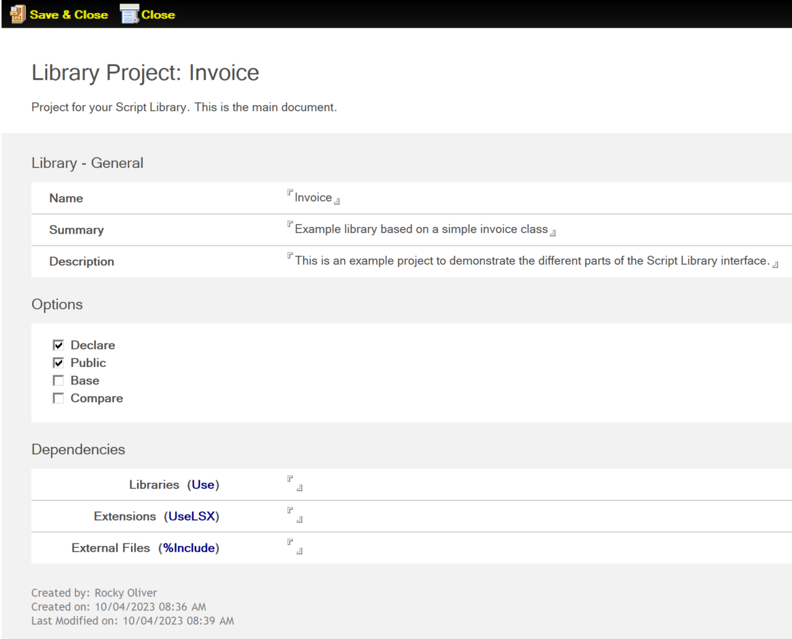

# Project

The *Project* form is used to define the general information about your Library project. Here you can provide a summary and description, define if your project is public, etc. You can also define any other libraries (VSS), extensions (VSE), or other external files needed for your project.

The following sections describe the fields on the *Project* form.

## Name

This is the Name of your Project, and is how it will be found in the **Script Library Projects** view

## Summary, Description

You can add an optional summary and description of your project in these fields.  

## Options

Select one or more options you wish to enable for your Library. Option Declare and Option Public are enabled by default.  

## Dependencies

Here you can specify other code for which your project depends upon. You can define Libraries, Extensions, or any other External Files.  