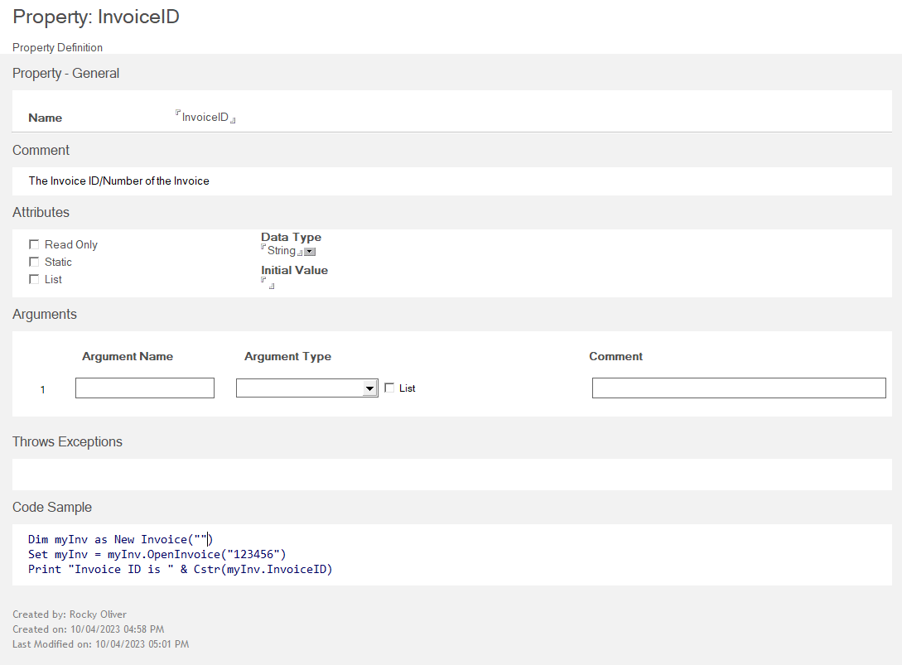

# Property 

The *Property* form is used to define any Property(ies) for a Project Library or a Class. With this form you provide the Name of your Property, any comments that explain the property, and the various attributes of the Property such as Read-Only, Data Type, Initial Value, etc. And as always you can provide some Sample Code to show how to interact with the Property programmatically.

Now there are a couple of things you can create that are at the Project level, as "Globals", or globally available items. These are [Variable](variable.md) and [Type](type.md).  

The following sections describe the fields on the Property form.

## Name

The name of the property. A property name **should not** be a VoltScript, LotusScript, or a C++ keyword.

## Comment

Enter any information relevant to the Property in this field.

## Attributes

The following Attributes may optionally be selected as needed: 

- [Read Only](#read-only)
- [Static](#static)
- [List](#debugger-causes-side-effect)
- [Data Type and Initial Value](#data-type-and-initial-value)

### Read-only

Select this attribute to indicate that the value of this property may not be set from VoltScript. If a script tries to change the value of this property, it gets a syntax error indicating that the property is read-only.

Also, no `Set<property_name>` function will be generated from this property, so the value may only be set from within its own class.

### Static

Defines whether or not the Property's local variables are saved between calls.  

### List

Indicates that the property is a List instance of its Data Type.  

### Data Type and Initial Value

In the **Attributes** area, you can specify the **Data Type** and **Initial Value** of the Property.

The **Data Type** field is where you select the data type of the objects to be collected. The drop-down list contains LotusScript datatypes, Domino Objects formerly called Notes back-end classes, and classes already defined in the project. You should select the datatype of the items in the collection.

The **Initial Value** field refers to the value that the property should be initialized to in the constructor's member initialization list for the class. This field may be a set to a literal value, or to the name of one of the arguments that you have specified for your constructor (the New method).  
