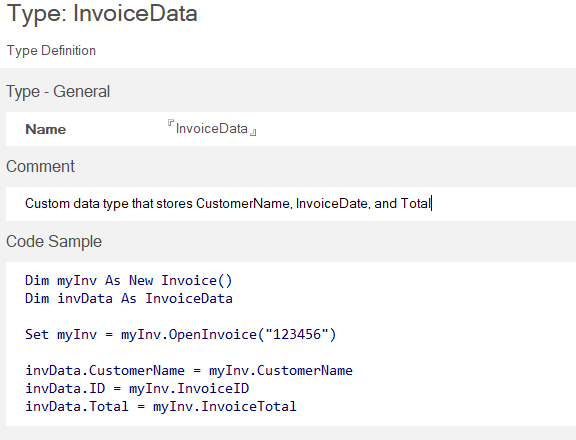

# Type

The *Type* form is used to define custom data types for your project.  

For instance, you may want a complex data type to store multiple bits of metadata about an entity or object. In our example we may want an InvoiceData data type that stores things like CustomerName, InvoiceDate, and Total.

