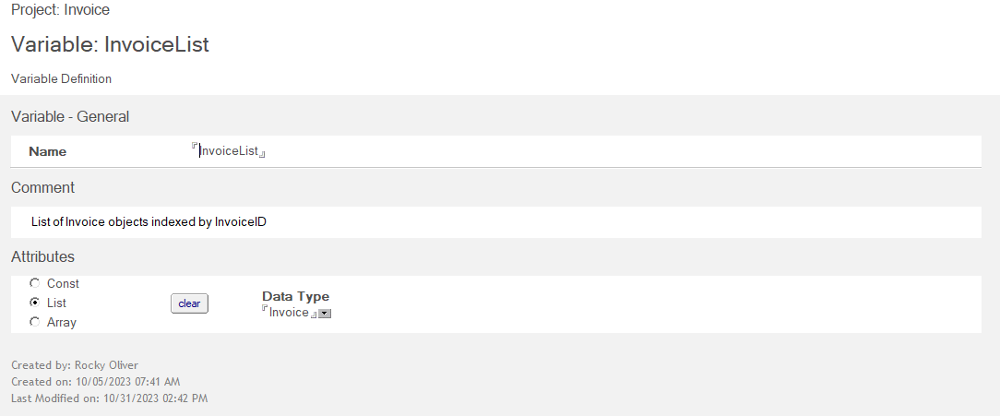

# Variable

The *Variable* form is used to define global variables in your project. You simply give your variable a name, add any optional helpful comments, and then define its attributes. A Variable can be a Constant, List, or Array, and you can define it as any Data Type.

In our Invoice example we have created a global variable called *InvoiceList*. This will be a variable where we can store a list of Invoice objects, indexed by InvoiceID.

