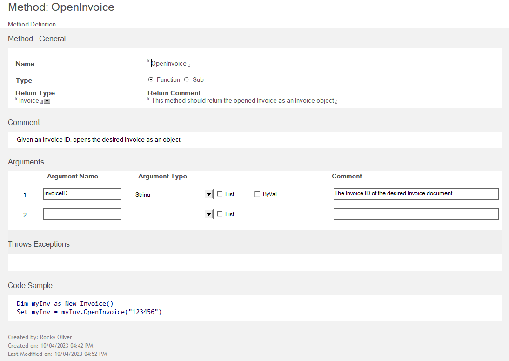
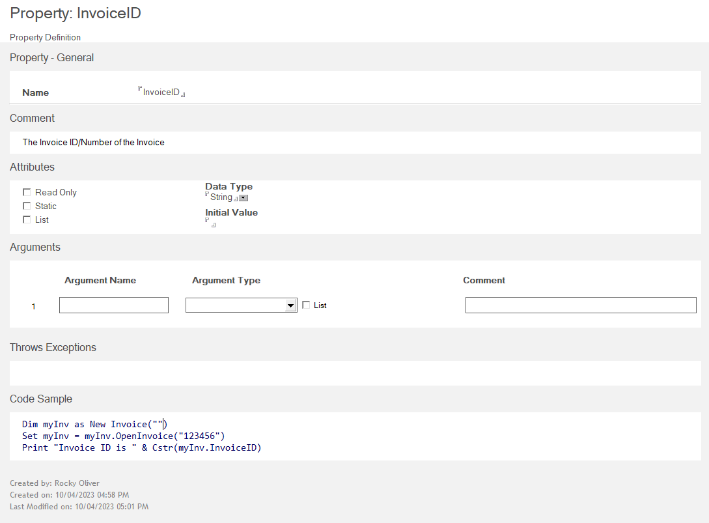

# Use VoltScript Library forms

This section gives you a basic introduction and details on how to use the various forms used when creating VoltScript Libraries (VSS). You can use these forms to create the foundation/"skeleton" for your library, and plan out your architecture before you write the code. This area can also be used to generate a set of API doc based on the signatures of your library.

## Project

The *Project* form is used to define the general information about your Library project. Here you can provide a summary and description, define if your project is public, etc. You can also define any other libraries (VSS), extensions (VSE), or other external files needed for your project.

## Class
  
The *Class* form is used to define a Class for your Project. You specify the name of your Class, provide any helpful comments, and optionally some sample code on how to invoke the class. 

If your class is derived from another class you can specify that in the *Derivation* area of the Class form.

Once you save your new Class the first time, it will automatically generate a New() Method doc under your Class document...

## Method

The *Method* form is used to define the Method(s) for your Class. The Methods defined can either be a *Function* (does some work, returns a value) or *Sub* (does some work, does NOT return a value). For our example Invoice class we need to provide a way to open an existing Invoice as an object, so let's create an `OpenInvoice` method.

In the Method form you give your Method a name, indicate if it's a Sub or Function, and if it's a Function indicate the Data Type it returns. You can optionally provide a comment explaining it if you'd like.

Most Methods will take one or more *Arguments*, and those can be defined in the Arguments section. In our example we need to provide an argument that allows an Invoice ID to be passed in.

Then you can provide any expections is throws as well as some sample code if desired.

## Property 

The *Property* form is used to define the Property(ies) for of your Class. In this form you provide the Name of your Property, any comments that explain the property, and the various attributes of the Property such as if it's Read-Only, Data Type, Initial Value, etc. And as always you can provide some Sample Code to show how to access the Property programmatically.

Now there are a couple of things you can create that are at the Project level, as "Globals", or globally available items. These are *Variable* and *Type*. Let's take a look at both of them.

## Variable

The *Variable* form is used to define global variables in your project. You simply give your variable a name, add any optional helpful comments, and then define its attributes. A Variable can be a Constant, List, or Array, and you can define it as any Data Type.

In our Invoice example let's create a global variable called *InvoiceList*. This will be a variable where we can store a list of Invoice objects, indexed by InvoiceID.

## Type

The *Type* form is used to define custom data types for your project. For instance, you may want a complex data type to store multiple bits of metadata about an entity or object. In our example we may want an InvoiceData data type that stores things like CustomerName, InvoiceDate, and Total.

