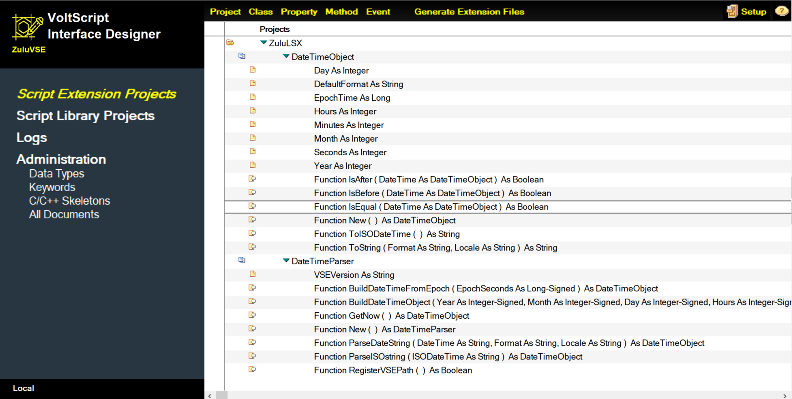

# VSID user interface

When you open the VoltScript Interface Designer (VSID), you are presented with a user interface having the following main screen:

## Left navigation pane 

The left navigation pane enables you to access the following areas:

**Script Extension Projects** 

The main view of the application where you can create and access your VoltScript Extension (VSE) projects.

**Script Library Projects**

The view where you can create and access your VoltScript Library (VSS) projects.

**Logs**

The view containing any logging tracked during processing operations.

**Administration**

The section storing all configuration documents, such as Data Types, Keywords, and C/C++ Skeletons.
    
!!!note
    Normally, you should not change any documents in the **Administration** section as doing so could adversely affect the performance of VSID. 

## App bar

At the top, you have the app bar that includes action buttons, such as **Projects** and **Class**, to create the different parts of your VSE Project. The **Generate Extension Files** enables you to generate your C/C++ extension files for further work in your C/C++ IDE. The app bar also includes the **Setup** button, and the **Help** button for accessing documentation.
