# VoltScript Interface Designer - Invoice library example

This section introduces you to using the VoltScript Interface Designer (VSID) - Library feature through an example Library. In this case, the example is a simple library that's used to access and update an invoice. You can find the Library in the *Invoice Library* database (INVLIB.NSF).

Please refer to the reference for the [various forms](../howto/libraryforms.md) found in the Library section.

The Library feature of VSID helps you plan and design your classes for your project, and generate the starting "skeleton" code to begin your development. It's recommended that you create one VSID database per project.

You can begin by creating the Project document. Open the Invoice Library database, and navigate to the **Script Library Projects** section. Here you'll find the Invoice project documents.

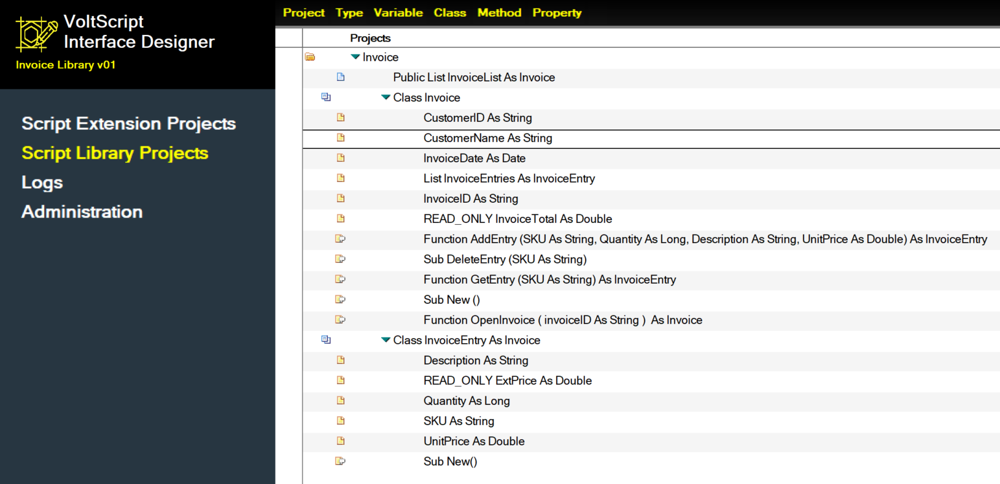

## Invoice project

You can begin by building the Invoice Project document. This form is where you give your project a name, define the various options for your project, and define dependencies your project has on other libraries or extensions. In this case the Invoice is a Public, Base class with no external dependencies.

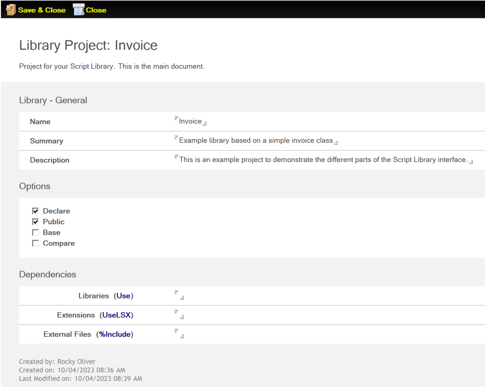

Now that you have a base Project document, begin laying out the classes. You can start by making your first *Class*, the Invoice class.

## Invoice class

The first class you'll create is your Invoice class. In this document, you give your class a name and indicate if your class is a *Base* or *Derived* class. A Derived class is one that's based on, or is derived from, another class. You usually do this to enhance a base class to better serve your needs and to add more functionality, while taking advantage of the properties, methods, and functionality provided by the "parent" class.

In this case, your Invoice class is a Base class.

You can also optionally add an example of how your class is called in the **Code Sample** area.

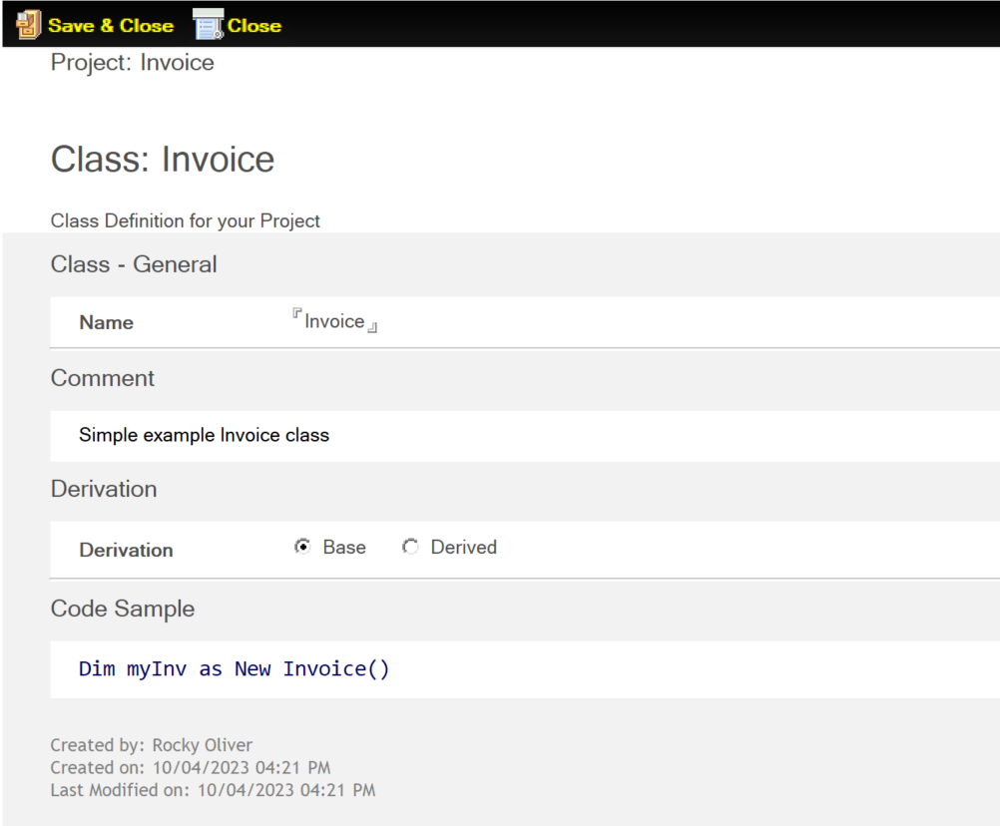

!!! Note
    Once you save and close a Class document the first time, it automatically generates a `Sub New()` Method document. This is because all Classes are required to have a New() constructor, even if it's not used programmatically.

Now that you have your class, add some properties.

## Invoice properties

Your Invoice class is used to programmatically load an invoice as an object. Therefore, you need to represent the data stored in the invoice in your class. You do this using *Property* documents. For your invoice, you want to access the following information:

- CustomerID - the unique identifier for the customer
- CustomerName - the name of the customer
- InvoiceDate - the date the invoice was created
- InvoiceID - the ID of the invoice
- InvoiceTotal - the total amount of the invoice

Take a look at a couple of these Property documents.

### CustomerID

The *CustomerID* property is a simple string value storing the unique ID of the customer. Therefore, you only need to provide the name of the property (CustomerID), and indicate that it's a String data type.

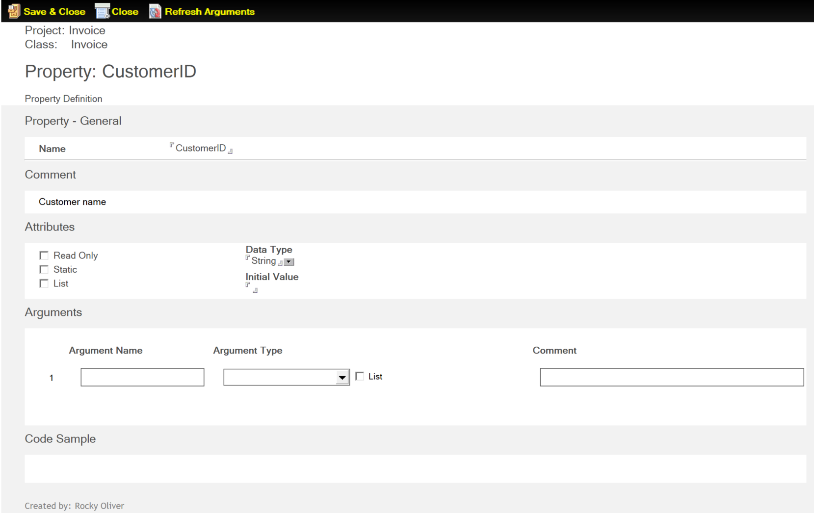

### InvoiceTotal

The *InvoiceTotal* property is used in your Invoice class to store the extended total amount of the invoice. However, since this is a computed value that should be derived from the total amount of the entries in your invoice, it should not be editable. Therefore, create a READ-ONLY property to compute and store this number.

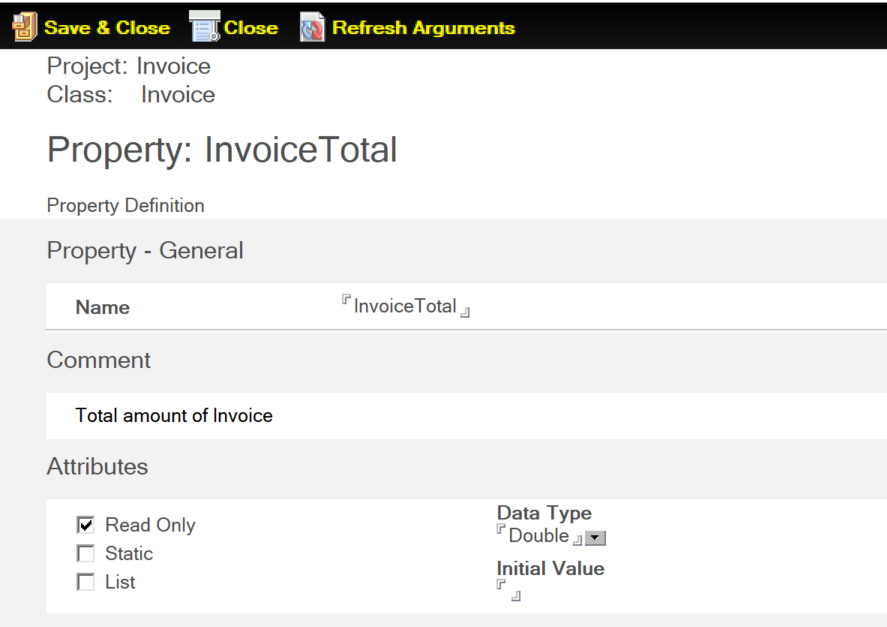

You give the property the InvoiceTotal name, set the Read-Only attribute, and set the Data Type to Double so it can properly store the total. Once you generate your skeleton code, you could then write some VoltScript to compute this total based on the entries of the invoice.

Now that you have the basics of your Invoice class built, you need some way to represent each individual entry, or row, within your Invoice. You do this by creating a second class, the *InvoiceEntry* class.

## InvoiceEntry

In your Invoice, you'll have individual rows of items that comprise the Invoice order. You need a way to programmatically access these individual rows. You'll do this by creating an *InvoiceEntry* class. 

Now since your InvoiceEntry objects are a part of the overall Invoice, you'll make your InvoiceEntry class derived from the parent Invoice class. This allows you to access the properties and methods of the parent Invoice object from the InvoiceEntry object.

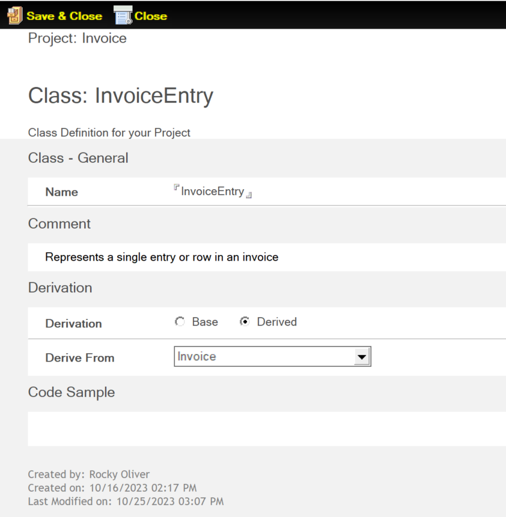

This class stores the following information about an individual Invoice row:

- Description - the name or description of the item
- SKU - the unique identifier of the item
- UnitPrice - the cost of a single item
- Quantity - the number of items ordered
- ExtPrice - the extended price of the entry, which is the `UnitPrice X Quantity`

    !!!note
        The ExtPrice property is READ-ONLY.

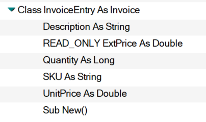

## Accessing InvoiceEntry Objects

You now have an Invoice class to represent an invoice, and you have a way to represent individual rows in your invoice using the InvoiceEntry class. But how do you create and access these individual rows? We'll do this using *Methods* from within your Invoice object.

You need to be able to do three things:

- Add an Invoice Entry
- Delete an Invoice Entry
- Get an existing Invoice Entry

Begin by creating a method for adding a new InvoiceEntry to your Invoice.

### AddEntry method

Create your new *AddEntry* method using the *Method* document. When creating a new InvoiceEntry object, provide all the relevant information contained within your InvoiceEntry object so that the properties are properly populated. Refer to the  AddEntry method:

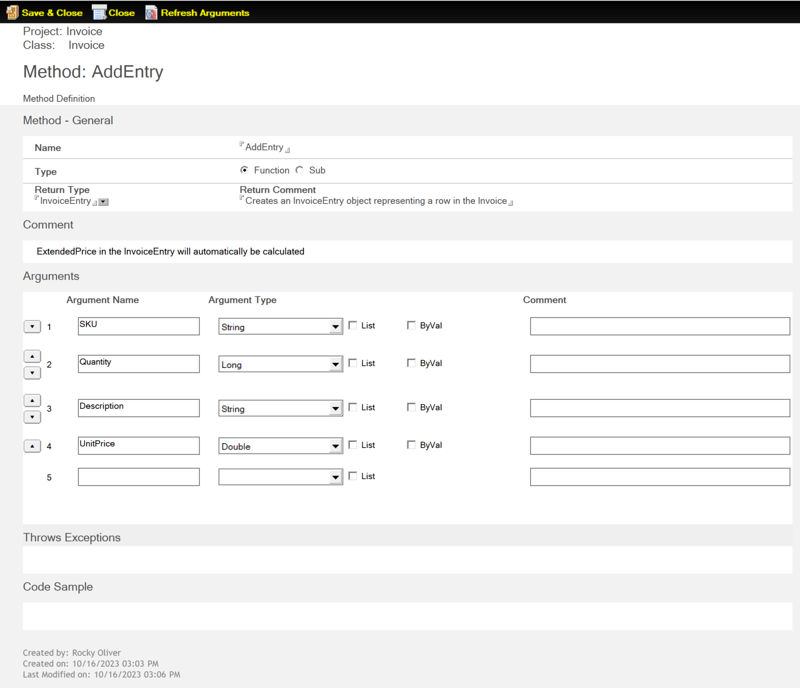

After entering the name, indicate the **Type** of method you're adding, either a **Sub** or a **Function**. 

!!!note
    Subs and Functions are simply a grouped set of programmatic instructions that can be referenced and used by name. The only difference between a Sub and Function is that a Function returns a value while and a Sub doesn't. 
    
In this case, the AddEntry method is a Function. Since it's a Function, indicate the **Return Type**, which is in this case an *InvoiceEntry* object.

Now you need to define the *arguments* for your method. These arguments will be a part of the *signature* of the method, or the name and parameters required to invoke this method. In this case, you're defining arguments that will be used to populate the properties of your InvoiceEntry. This includes *SKU*, *UnitPrice*, *Quantity*, and *Description*.

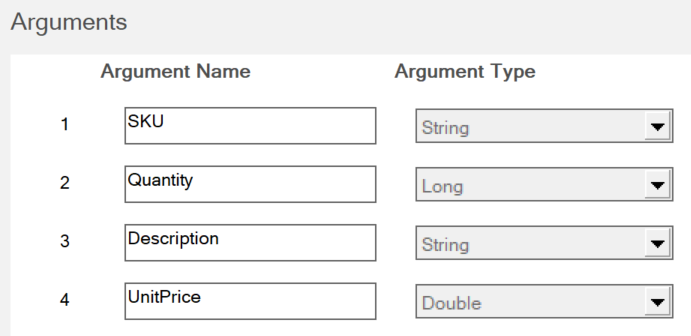

You also define the arguments' data types:

- SKU - String
- Quantity - Long
- Description - String
- UnitPrice - Double

!!!note
    You do not need to pass the ExtendedPrice as a parameter, since it's read-only and will be computed based on the UnitPrice and Quantity.

Once saved, you can see your new method's signature in the view.

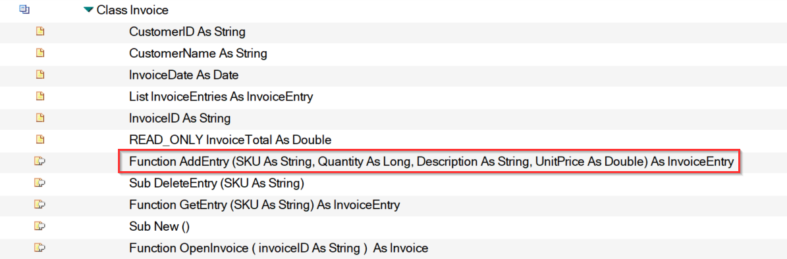

Now that you have a way of adding a new InvoiceEntry, you need a way to access existing entries. You'll do this by creating a *GetEntry* method.

### GetEntry method

To access individual invoice entries, create the *GetEntry* method. Since the SKU is the way you uniquely identify the items in an invoice, you'll use that as your key for accessing the desired entry.

Since you're returning an InvoiceEntry object, you'll set this method as a Function that returns an InvoiceEntry object.

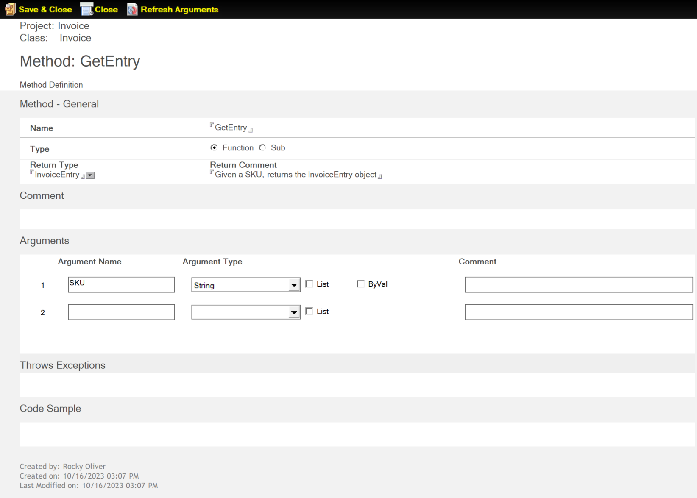

Now that you have a way to create and access an InvoiceEntry, create a way to delete an entry.

### DeleteEntry method

You need a way to programmatically remove an entry from an invoice, so create a *DeleteEntry* method. Since you're deleting an entry and there's no need to return a value, so you'll define this method as a Sub. To identify which entry to remove, provide the SKU as the argument for your sub.

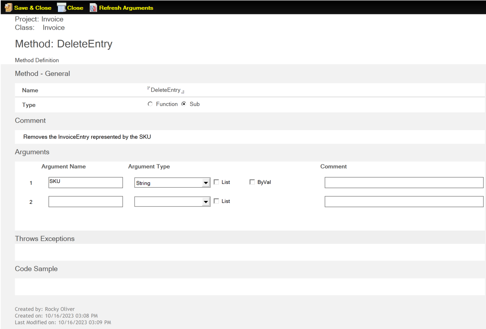

Now that you have an Invoice class to represent a customer's invoice, and InvoiceEntry class to represent individual rows in your Invoice, you need a place to store the individual InvoiceEntry objects that comprise your Invoice. So add a special property to your Invoice class.

### List InvoiceEntries property

Class properties aren't limited to scalars and objects. They can also be arrays and lists. A list would be a perfect way to store and provide access to all the entries in your invoice. So, create a new property in your Invoice class called *ListEntries*.

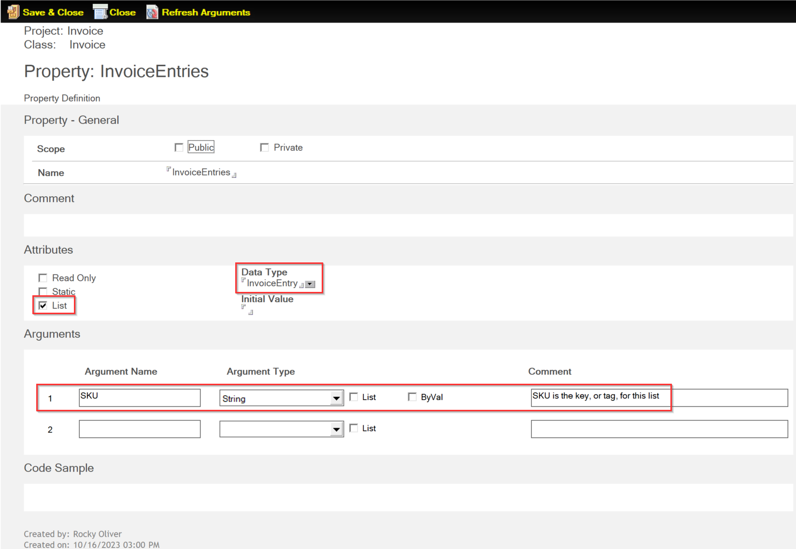

After providing the name of your InvoiceEntries property, you need to make sure **List** is selected in the **Attributes**. Set the **Data Type** to InvoiceEntry, because this will be a list of InvoiceEntry objects. Since you use the SKU to uniquely identify your invoice entries, you need to provide it as a parameter.

Now you need a way to actually load an invoice into memory, so create an *OpenInvoice* method.

## OpenInvoice Method

You need to have a way to load an existing invoice into an Invoice object, so create an *OpenInvoice* method.

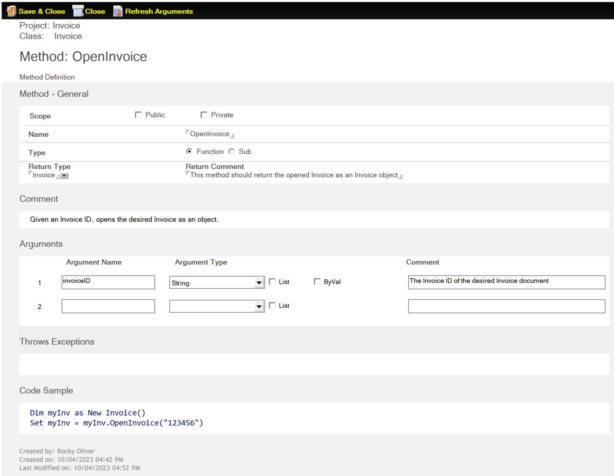

In your method, you know that you want it to return an Invoice object, so you need to set it to be a Function with a Return Type of Invoice. Since you're using InvoiceID as your unique key for an Invoice, you need to add InvoiceID as an argument in your method signature.

## InvoiceList List variable

One interesting thing about Library projects is that you can have some things defined in your Library, but that aren't a part of an actual class. *Types*, *Variables*, and *Properties* can all exist in a Library but outside of a class. If you're familiar with LotusScript, this is similar to the things you can put in the `(Declarations)` area of a Script Library.

For your Invoice project, create a public Variable that can hold a list of Invoice objects. This way you could, say, load all the invoices for a particular customer into memory for easier access.

To create this InvoiceList variable, you simply make sure you have the *Project* document selected in the view, then click the Variable action button.

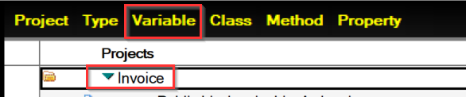

Enter the name as InvoiceList, set the Scope to Public, and under Attributes select List then set the Data Type to Invoice, since this will be a list of Invoice objects.

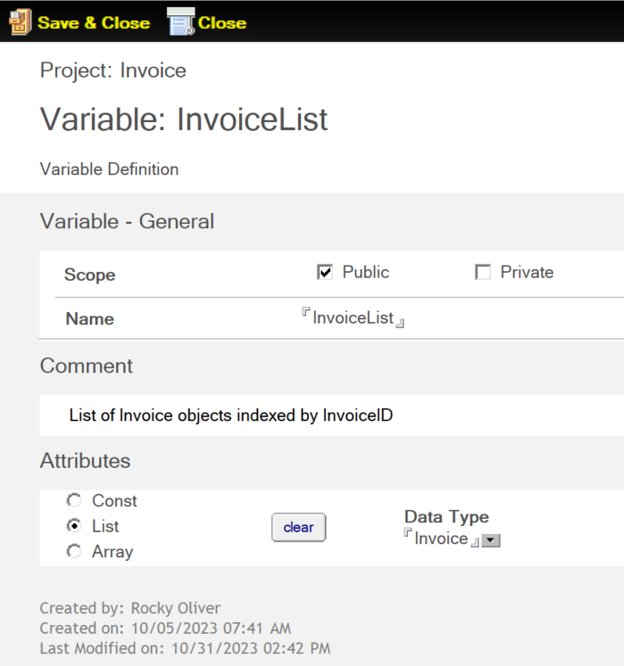

