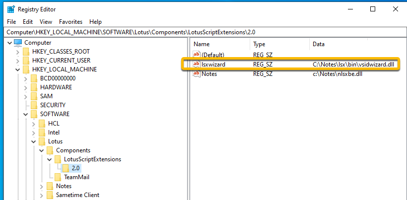

# Installation and setup

Guides you through the procedures for installing and setting up VoltScript Interface Designer (VSID).

## Download VSID repository

- Download the VSID repository from [GitHub](https://github.com/HCL-TECH-SOFTWARE/voltscript-interface-designer).  

The VSID repository includes:

- `vsid.ntf` - A *VSID Notes template*, which is a Notes-based database template (NTF), that is used to create VSID databases.
- `vsidwizard.dll` - A *VSID Wizard DLL* used by VSID to compile and set up the VSE directory structure and files for your VSE on your computer.
- `Invlib.nsf` - A *VSID database* containing sample documents used in the [Invoice library example Tutorial](invoicelibrarysample.md)
- `VSESamples.zip` - An archive containing sample files used in the [VoltScript Extension samples Tutorial](../tutorials/vsesamples/index.md)
- `vsid.nsf` - A *VSID database* containing documentation for the LotusScript libraries within VSID that generate VoltScript Extensions, VoltScript Source, and API documentation.  This database provides an example of the various types of documents (Project, Class, Method, etc.) used by VSID.  
- The *On Disk Project* containing VSID exported source (YAML files).  
- Additional documentation and instructions.  

## Setup  

1. Place the `vsid.ntf` in your Notes data directory.
2. Place the `vsidwizard.dll` in your Notes program directory, or **within a subdirectory therein.**  

    !!!note
        Make sure to note the full directory path where you placed the DLL. It is recommended to place it in a subdirectory, such as `<notes program dir>/lsx/bin`.

## Register the wizard DLL

For your system to locate and use the wizard DLL, register the DLL with Windows by listing it in the Windows Registry. This can be accomplished by either:

- Running the following command (using Administrator Privileges),  replacing `<Wizard Path>` with the correct full path to the wizard DLL location:

    ```{ .yaml .copy }
    REG ADD HKLM\Software\Lotus\Components\LotusScriptExtensions\2.0 /v lsxwizard /t REG_SZ /d "<Wizard Path>" /f 
    ```

- Using the Windows *Registry Editor* to edit the registry and create a new *String Value* with the name `lsxwizard` and the value of your full path the the wizard DLL location.   
      

Now that you have VSID set up on your system, you can either create a new VSID database or upgrade an old LSX Toolkit database to VSID.